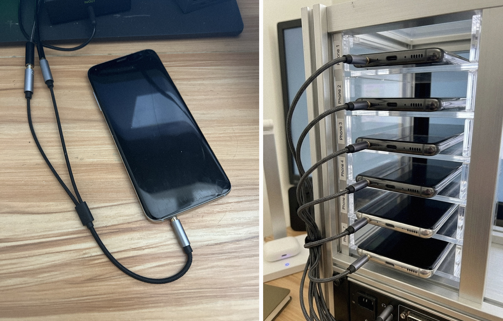

# Old Phone, New Trick: How I Turned a Samsung S8 Into a Simultaneous Interpreter

> Also published on LinkedIn: [Old Phone, New Trick: How I Turned My Samsung S8 Into a Simultaneous Interpreter](https://www.linkedin.com/pulse/old-phone-new-trick-how-i-turned-my-samsung-s8-slava-ponomarev-70sdc/)



[Demo video](assets/demo.mp4)

---

Two years ago I started asking myself a question that seemed simple on the surface: why is real-time speech translation still so hard for everyday people in 2026? We can generate video with AI, write production code with AI, hold conversations with language models that feel genuinely intelligent. Yet a person sitting in a room trying to understand a speaker in a different language still has almost no good options. Subtitles require you to stare at a screen. Professional interpreters cost a thousand dollars a day. Consumer translation earbuds sound like they were designed by someone who never actually used them in a real conversation.

For me this was not a theoretical problem. My wife speaks Russian. Most of the events we attend are in English. Church services, conferences, community gatherings, guest speakers. She could follow pieces of what was being said, but tracking a full sermon or presentation in real time was exhausting. I wanted to build something that would let her hear a natural translation directly in her ear while the speaker was talking. Not a transcript. Not a summary. Not a three-second delay. Actual real-time translation.

That goal sent me down a rabbit hole that lasted the better part of two years.

---

## Eight Months of Getting It Wrong

My first instinct, like most engineers working with AI today, was to stay offline. I wanted a fully local system: speech recognition on the device, translation on the device, text-to-speech on the device. No cloud. No privacy concerns. No dependency on external infrastructure. Over eight months I built four completely different versions of the pipeline.

The first version used Whisper for speech recognition and NLLB for translation, running on local hardware. Quality was reasonable. Latency was around four seconds. That sounds acceptable until you actually sit in a room and try to follow a speaker with a four-second delay. By the time you hear the translation of one sentence, the speaker is two sentences ahead. Context falls apart. You stop trying to understand and start just surviving the experience.

I tried optimizing. Smaller Whisper models, quantized NLLB, hardware acceleration. Got it down to two and a half seconds. Still unusable for live speech. Then I switched to Meta's SeamlessM4T, which promised streaming-mode inference. The streaming worked but Russian translation quality dropped noticeably, and the system struggled with any domain-specific terminology. A sermon has words like "sanctification," "covenant," and "grace" used in very specific ways. Getting those wrong breaks comprehension entirely.

The fourth version used a local LLM as the translation layer, with a context window carrying the last few sentences to keep terminology consistent. Quality improved. Latency climbed back to four seconds. I had a dual RTX 3090 setup at home, which is not a small amount of compute, and I still could not get the combination of speed and accuracy I needed. Every path hit the same ceiling. The fast models were not good enough. The good models were not fast enough. Four versions. Four times almost there. Four times no.

---

## The Discovery I Almost Missed

A few weeks ago, while working on yet another iteration, I noticed something I had somehow overlooked for months. Google Translate had quietly added a Live Translation mode that was genuinely good. Not "impressive for a demo" good. Actually usable in a real setting. Latency under a second. Translation quality solid across major languages. Speaker language detection that worked automatically. I tested it for an hour and kept waiting for it to break. It did not.

The obvious move was to just use it. The problem was also obvious once I looked for it: Google Translate on Android only captures audio from the device's built-in microphone. There is no input source selector anywhere in the application. No advanced settings. No developer menu. No API flag. The app calls Android's `AudioRecord.DEFAULT` source and the operating system decides which microphone to use. It picks the built-in one. Always.

I tried routing audio from my laptop into the phone. Tried external USB adapters. Tried Bluetooth microphones. Google Translate ignored all of them and listened to the phone's internal mic, which was picking up ambient room noise instead of the speaker I was trying to translate. This was a dead end if I stayed within what the app allowed.

---

## The Phone in the Drawer

I went looking through old hardware for a phone that still had a 3.5mm headphone jack. Modern flagships dropped it years ago in pursuit of thinner profiles and water resistance ratings, but the jack has a property that matters here: TRRS connectors carry both audio output and microphone input on the same physical connector. With an inexpensive TRRS splitter, you can separate those channels and connect a dedicated external microphone on the input side while routing translated audio to earphones on the output side simultaneously.

I found a Samsung Galaxy S8 sitting in a drawer. Released in 2017, fully functional, gathering dust. The jack was there. I ordered a TRRS splitter for a few dollars and connected an external condenser microphone for input and an in-ear monitor for output. At the hardware level everything worked perfectly. The phone detected the microphone. Android acknowledged it. Google Translate continued listening to the built-in mic.

The only path forward was to modify how Android reports audio routing at the system level. That meant root access.

---

## Rooting the Phone: What Actually Works and What Does Not

Before getting into the process, there is a critical hardware detail that will save you a lot of frustration. Not all Samsung Galaxy S8 models can be rooted.

Samsung ships the S8 in two hardware variants. European and global models run Samsung's Exynos 8895 processor. US models run the Qualcomm Snapdragon 835. The processors are similar in performance, but the bootloader policy is completely different. US carriers (AT&T, Verizon, T-Mobile, Sprint) include bootloader lock requirements in their distribution agreements with Samsung. The result is that US S8 units have the OEM Unlock option permanently disabled or absent from Developer Options. Samsung's KNOX security mechanism trips permanently on any modification attempt, locking the device against further changes.

The models that work are the Exynos variants:

| Model | Region |
|-------|--------|
| SM-G950F | Global / Europe |
| SM-G950FD | Dual SIM |
| SM-G950N | Korea |
| SM-G950X | Canada |

The models that do not work: SM-G950U and SM-G950U1, which cover essentially every unit sold through a US carrier or as an unlocked US device.

You can verify your specific unit before starting:

```bash
adb shell getprop sys.oem_unlock_allowed
# 1 = unlockable, 0 = locked by carrier

adb shell getprop ro.csc.sales_code
# ATT / VZW / TMB = US carrier model = cannot root

adb shell getprop ro.product.model
# should be SM-G950F, not SM-G950U
```

### Step 1: Unlock the Bootloader

Enable Developer Options by tapping Build Number seven times in Settings > About Phone. Then go to Developer Options and enable OEM Unlocking. Reboot into Download Mode by holding Volume Down + Bixby + Power simultaneously.

### Step 2: Install TWRP Custom Recovery

Download TWRP for the SM-G950F from `twrp.me/samsung/samsunggalaxys8.html` and flash it using Odin on Windows. Place the TWRP `.img.tar` in the AP slot and click Start. Samsung uses Odin for flashing, not `fastboot flash`.

### Step 3: Install Magisk for Root Access

Grab the latest release from `github.com/topjohnwu/Magisk`. Boot into TWRP, choose Install, select the Magisk ZIP, swipe to confirm, and reboot. Magisk installs cleanly on Android 8.0 without issues.

### Step 4: Install EdXposed Framework

This step trips people up. LSPosed, which is the modern successor to Xposed, requires Android 8.1 as a minimum. Android 8.0 requires EdXposed specifically. Install Riru first as a dependency (`github.com/RikkaApps/Riru`), then EdXposed YAHFA (`github.com/ElderDrivers/EdXposed`), then the EdXposed Manager app (`github.com/ElderDrivers/EdXposedManager`). All of these install through Magisk Manager under Modules.

### Step 5: Install the Microphone Override Module

The module is at `github.com/anton-arnold/xoverrideheadphonejackdetection`. Install the APK, open EdXposed Manager, find the module in the Modules list, enable it, reboot. After rebooting, open the app, enable Override, and select Headset Detected.

What the module does internally: it hooks into Android's `WiredAccessoryManager.notifyWiredAccessoryChanged()` and tells the operating system that a headset with a microphone is permanently connected through the jack. From that point on, every application on the device inherits this routing. There is nothing app-specific to configure. Google Translate, voice recorders, any app that captures audio will use the external microphone as long as something is physically connected to the jack.

For command-line configuration:

```bash
adb shell am broadcast \
  -a de.antonarnold.android.xoverrideheadphonejackdetection.ConfigReceiver \
  --ei overrideEnable 1 \
  --ei overrideValue 4 \
  --ei overrideMask 255
```

### All Repositories

```
Magisk:           github.com/topjohnwu/Magisk
Riru:             github.com/RikkaApps/Riru
EdXposed:         github.com/ElderDrivers/EdXposed
EdXposed Manager: github.com/ElderDrivers/EdXposedManager
Mic module:       github.com/anton-arnold/xoverrideheadphonejackdetection
TWRP for S8:      twrp.me/samsung/samsunggalaxys8.html
```

---

## What It Actually Looks Like Now

The setup is a small external microphone clipped near the speaker, connected via a TRRS splitter to the S8. My wife wears an in-ear monitor connected to the same splitter on the output side. I open Google Translate, set the source language to Detect, set the target to Russian, and tap the microphone button. That is the entire operation.

The system picks up the speaker's language automatically. English, Spanish, Chinese, Korean, French, and anything else Google Translate supports all work without changing any settings. It identifies male and female voices and adjusts accordingly. The translation arrives in under a second. She follows the sermon. She laughs at the jokes at the right moment instead of four seconds afterward. It works.

For conferences and international events, the setup scales. Each attendee runs their own phone with Google Translate set to their preferred target language. One audio source feeds all of them simultaneously. Russian, Korean, Chinese, and Spanish translations can run in parallel from a single speaker. No interpreter booths. No dedicated translation hardware. Just phones, a microphone, and an inexpensive splitter.

---

## The Part That Is Still Unfinished

Using Google Translate solves the problem I set out to solve. It is not my final answer, and I want to be direct about why.

Every word processed by Google Translate leaves the device. Google stores it, processes it, and uses it to improve their models. For a church sermon I have made peace with that tradeoff. But there are environments where live translation would be genuinely valuable and where cloud processing is completely unacceptable. Legal proceedings where attorney-client privilege applies. Medical consultations. Defense and intelligence contexts. Production studios working under NDA. Corporate negotiations involving information that cannot leave the room. For all of these, the current system is unusable regardless of how well it works technically.

My original goal was a fully local system, and I still intend to build one. The open-source speech-to-speech landscape has moved fast enough in the past year that I think a practical offline solution is closer than most people expect:

- **CosyVoice 3** from Alibaba's FunAudioLLM: 9 languages including Russian natively, roughly 150ms to first audio output, voice cloning from a short reference sample, Apache 2.0 license
- **SeamlessStreaming** from Meta: 100+ input languages with real streaming inference
- **UniSS** (ICLR 2026): single model for recognition, translation, and synthesis that preserves the speaker's voice characteristics and speaking pace. Currently English-Chinese only, but the architecture points in the right direction.

None of these replaces the current setup today. Combined with local LLM translation running on my own hardware (2x RTX 3090, 48GB VRAM total), with serious latency optimization work, I believe a full offline system is within reach. When it is, I will write about it separately.

---

## What I Actually Learned From Two Years of This

The biggest lesson is not technical. I spent eight months convinced the answer was a fully offline system, building increasingly sophisticated pipelines that were always close but never quite good enough. Meanwhile, Google quietly shipped something that worked. Checking what the incumbent just released would have saved months of work.

The hardware insight surprised me more. The headphone jack is "obsolete." That is exactly why it was available, cheap, and capable of doing something no current flagship phone can do out of the box. A 2017 phone with a connector that got removed from modern devices turned out to be the key component.

The gap between "this works technically" and "my wife can actually use this at church on Sunday" is where most of the real engineering lives. One-button operation, under-a-second latency, no configuration on her end, reliable enough that I do not think about it during the service. Getting there took longer than getting the core pipeline to work.

Innovation does not always come from new hardware or new models. Sometimes it comes from combining things that already exist in a way nobody tried before. A seven-year-old phone, a free translation app, a three-dollar adapter, and an open-source module from GitHub. Total cost was the time I spent on it.

My wife understands the sermon now. That was the whole point.

---

## License

MIT. Do what you want. If you improve it, share what you learned.

The XOverrideHeadphoneJackDetection module was built by [@anton-arnold](https://github.com/anton-arnold). This whole thing is built on that module.
